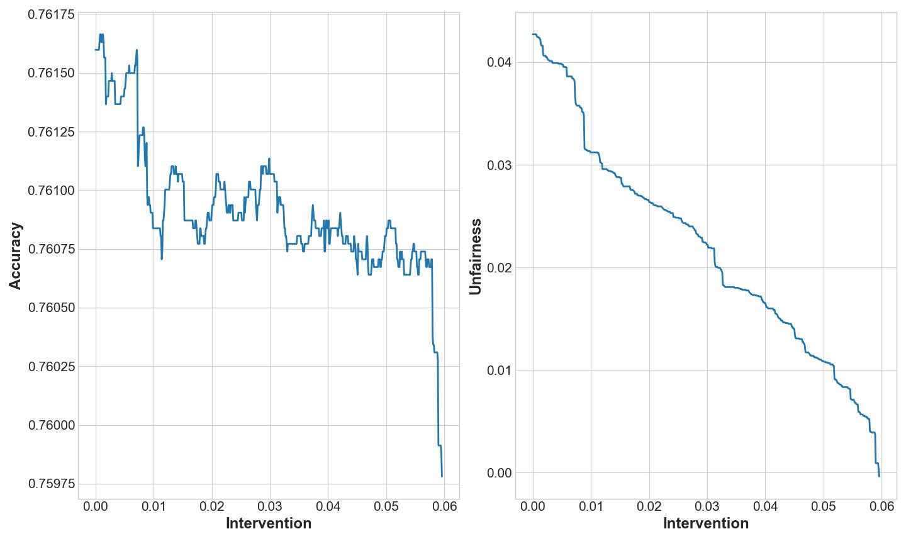
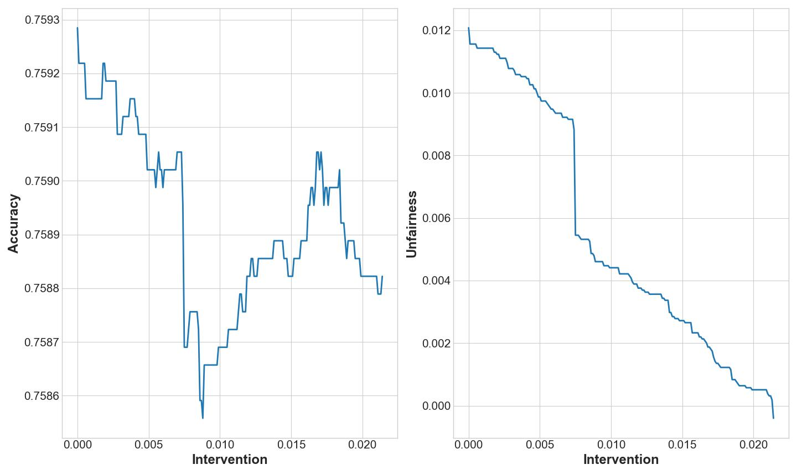

# Masterthesis-Fairness
This is the repository to my master thesis called "Evaluating Tradeoffs Between Algorithmic Accuracy and Fairness"
supervised by the chair of Public and Behavioral Economics at Johannes Gutenberg University Mainz. The thesis' summary
as well as the main findings can be found in the following. The figures can be reproduced using the two python files
provided. The data set used is available to the public using the folktales package. 

## Summary
Traditional approaches to evaluating machine learning predictions mainly consider minimizing some type of error.
They are usually not concerned with determining how the error is distributed between different groups. Taking a deeper
look, it is found that algorithms produce unfair decisions in many applications. Depending on the source of bias, it is
possible that pre-existing, societal biases are amplified using automated decision-making, and vicious cycles are
produced. There are many ways how fairness can be measured, but it is up to the researcher to decide which criterion to
choose and optimize for. As the most common fairness metrics cannot be satisfied at the same time, different fairness
views produce different results. Fair outcomes can be enforced using different techniques, though, increasing fairness
is generally associated with a loss in accuracy. In order to determine social optima, these trade-offs need to be
quantified. In the applied part of this work, neural networks are used to predict whether Californian residents are
employed or not and it is compared how the predictions differ between men and women using demographic parity as fairness
metric. For comparison, both gender-aware and gender-blind models are considered and accuracy and unfairness are
computed for each. In many scenarios, including sensitive attributes for automated decision-making is currently not
legal. However, if the aware model offered both more accurate predictions and less unfairness, which is suggested by
some authors, it should be discussed whether the laws act contrary to their intended purpose and should be repealed.
After comparing the unconstrained models and finding that both models produce results that do not satisfy demographic
parity, a post-processing fairness intervention is applied. In this context, the threshold for the disadvantaged group
is continuously lowered until the predicted employment rates are equal for men and women. Based on the ACSEmployment
data set, the following conclusions can be drawn. First, the unconstrained, gender-aware model produces more accurate
predictions compared to the blind one. Second, conversely, the unconstrained, gender-aware model produces outcomes that
are more unfair initially. Third, after applying the fairness intervention, the gender-aware model produces slightly
more accurate predictions at the same level of fairness. Since firms currently do not internalize potential unfairness
and choose to use unconstrained models for profit maximization, restricting the use of sensitive attributes for
automated decision-making yields more fair, but slightly less accurate outcomes. Given the aim of current regulation to
protect minorities from algorithmic discrimination, the legislation should not be changed according to the results.

## Results 
### Fairness and Accuracy Using The Gender Aware Model

Notes: The x value "Intervention" measures the difference in threshold values. For example, a value of
0.010 means that the probability of men being employed has to exceed 0.5 in order for them to be classified as positive,
while the necessary threshold value is lowered to 0.40 for female observations. By continuously lowering the threshold
of the disadvantaged group, it is possible to find gender-specific threshold values, where the share of being classified
as employed is equal for both men and women. As can be seen on the right part of the figure, the fairness is roughly
increasing linearly with bigger intervention levels. Conversely, the accuracy levels remain roughly constant for
intervention values between 0.01 and 0.05 and there are big jumps at the beginning and end of the curve. In total, using
the gender-aware model, a loss in accuracy of 0.18 percentage points is necessary in order to reduce unfairness as
measured by demographic parity by 4.27 percentage points.

### Fairness and Accuracy Using The Gender Blind Model

Notes: As expected, the accuracy is lower when dropping gender from the model. In contrast, the initial
unfairness only amounts to 1.21\%. While initial unfairness is lower than in the previous model, demographic parity is
not yet satisfied.  The plot for unfairness looks similar to the one using the gender-aware model, though there is one
big jump in the middle. While overall accuracy is also lower after the fairness intervention, it can be seen that
increasing fairness in not always associated with a loss in accuracy. Note though that the gains in accuracy between
0.010 and 0.020 look bigger than the ones seen in the previous figure, as the axes are not on a common scale.
Demographic parity is first satisfied using the gender-blind model when the threshold for women is lowered by 2.14
percentage points. At this intervention level, the accuracy amounts to 75.88%. In total, a loss in accuracy of 0.05
percentage points is necessary in order to reduce unfairness as measured by demographic parity by 1.21 percentage
points.

### Overall Comparison Between Gender Aware and Blind Model
|                               | Gender Aware Model | Gender Blind Model |
|-------------------------------|--------------------|--------------------|
| Initial Accuracy              | 0.7616             | 0.7593             |
| Initial Unfairness            | 0.0427             | 0.0121             |
| Necessary Intervention        | 0.0596             | 0.0214             |
| Unfairness after Intervention | -0.0004            | -0.0004            |
| Accuracy after Intervention   | 0.7598             | 0.7588             |
| Loss in Accuracy              | 0.0018             | 0.0005             |

### Implications
 From an accuracy maximizing perspective, it is best to include gender in the model. From a fairness perspective, gender
 should be dropped before training. After applying the fairness intervention, accuracy scores can be compared at the
 same level of unfairness. When satisfying demographic parity, the gender-aware model yields an accuracy score of
 75.98%, whereas a score of 75.88% is achieved using the blind model. The increase in accuracy of 0.1 percentage points
 is minor and should be compared to the potential risks of allowing sensitive attributes to be used for decision-making,
 i.e., firms actively using the protected attributes to discriminate against minorities. From a firm's profit
 maximization perspective, there is currently no incentive to ensure fair classification as measured by demographic
 parity. This means the initial predictions should be used to compare gender-aware and gender-blind approach.
 Therefore, according to the results of this data set, changing current law and allowing sensitive attributes to be used
 for prediction tasks would actually reduce overall fairness.